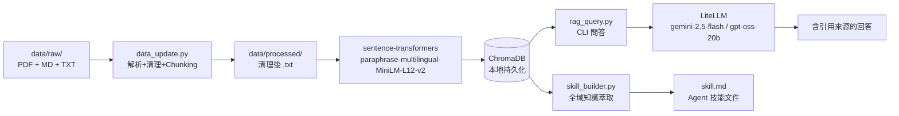

# AIASE2026-HW3：影像類 AI 醫材法規 RAG 系統

> **開發 Python 版本：3.11.9**
> 主題：影像類 AI 醫材（含軟體生命週期）法規整理

## 1. 專案簡介

本系統針對**影像類 AI 醫材法規**建構 RAG 知識庫，整合以下法規體系：

- **ISO 14971**（醫療器材風險管理）
- **IEC 62304**（醫療器材軟體生命週期）
- **TFDA 相關指引**（網路安全、AI/ML 臨床評估、EP 基本規範）

選題理由：影像 AI 醫材（如 ICH 腦出血 AI、眼底 AI）正快速進入臨床，但法規合規要求橫跨多份中英文標準，不易快速查詢與交叉參照。本 RAG 系統讓開發者能用自然語言提問，直接取得具引用來源的法規答案。

**資料規模**：20+ 份文件（7 份官方 PDF + 13+ 份補充筆記/摘要），約 300+ chunks。

## 2. 系統架構



## 3. 設計決策說明

### Chunking 策略
- **策略**：段落優先（雙換行切分）+ 超長段落退化為固定長度 + overlap
- **chunk_size = 800**：法規條文平均 300-600 字，800 確保完整條文不被截斷
- **overlap = 150**：確保條文與其解釋說明的跨 chunk 上下文連貫
- **最小過濾 50 字**：移除頁碼殘留、孤立標題等無意義片段

### Embedding 模型
- **選用**：`paraphrase-multilingual-MiniLM-L12-v2`（sentence-transformers）
- **理由**：法規文件中英混合（TFDA 中文 + ISO/IEC 英文），此模型支援 50+ 語言，384 維向量平衡速度與品質
- **完全免費**：本地執行，無需 API Key，無 $3 預算消耗壓力

### Vector DB 選型
- **選用**：ChromaDB
- **理由**：純 Python、零設定、無需 Docker，適合法規文件量級（< 10,000 chunks）；cosine 距離對語意搜尋效果佳

### Retrieval 策略
- **top-k = 6**：實測法規問題通常需要 4-8 個 chunk 才能完整回答跨標準問題
- **Cosine Similarity**：法規文字的語意相似度比 Euclidean 距離更穩定

### Idempotency 設計
- 以 MD5 hash 記錄每個文件的處理狀態（`.data_hashes.json`）
- `--rebuild`：清空 `processed/`、ChromaDB、hash 記錄，確保全量重建
- 增量更新：比較 hash，只處理有變動的文件
- upsert 前先刪除同 source_file 的舊 chunks，避免重複累積

## 4. 環境設定與執行方式

### 4-1. Python 版本確認

```bash
python3 --version   # 需顯示 >= 3.10.x（開發版本：3.11.9）
```

### 4-2. 建立虛擬環境

```bash
python3 -m venv .venv
source .venv/bin/activate      # Linux/macOS
# .venv\Scripts\activate       # Windows
```

### 4-3. 安裝套件

```bash
pip install -r requirements.txt
```

> 首次執行 `data_update.py` 時，sentence-transformers 會自動下載模型（約 420MB）。

### 4-4. 設定環境變數

```bash
cp .env.example .env
# 填入 LITELLM_API_KEY 與 LITELLM_BASE_URL（助教提供）
```

### 4-5. 放入原始文件

將 PDF 文件放入 `data/raw/`（參考 `data/raw/README_data_sources.md`）：
- `ISO14971_2019.pdf`
- `IEC62304_2006_AMD1_2015.pdf`
- `TFDA_cybersecurity_guideline.pdf`
- `TFDA_AI_ML_clinical_eval.pdf`
- 其他補充文件

### 4-6. 全量重建索引

```bash
python data_update.py --rebuild
```

### 4-7. 測試 RAG 問答

```bash
python rag_query.py --query "輸入圖像之處理程序是什麼？"
python rag_query.py --query "TFDA 對影像 AI 醫材的 SBOM 要求？"
python rag_query.py   # 互動式模式
```

### 4-8. 生成 Skill 文件

```bash
python skill_builder.py --output skill.md
```

### 4-9. 測試 PDF 解析（開發輔助）

```bash
python test_pdf_chunking.py data/raw/ISO14971.pdf --compare-strategies
python test_pdf_chunking.py data/raw/ --all
```

## 5. 資料來源聲明

| 來源名稱 | 類型 | 授權/合規依據 | 數量 |
|---|---|---|---|
| ISO 14971:2019 | 英文 PDF | 原始標準文件僅於本地端進行 RAG 測試與萃取，依法不包含於此公開的 GitHub 儲存庫中 | 1 份 |
| IEC 62304:2006+AMD1 | 英文 PDF | 原始標準文件僅於本地端進行 RAG 測試與萃取，依法不包含於此公開的 GitHub 儲存庫中 | 1 份 |
| TFDA 醫療器材法規文件 | 中文 PDF | 政府公開文件 | 6 份 |
| FDA 醫療器材法規文件 | 英文 PDF | 政府公開文件 | 9 份 |
| 國際標準 IMDRF 官方文件 | 英文 PDF | 政府公開文件 | 3 份 |
| 軟體生命週期 Markdown 範本 | Markdown | 個人著作 | 5 份 |

## 6. 系統限制與未來改進

**目前限制：**
- Embedding 模型為通用多語言模型，非醫療法規領域 fine-tuned，專業術語的語意捕捉有限
- Chunking 未考量表格結構（法規文件中的對照表常被切斷）
- 缺乏 reranking（Cross-encoder）機制

**未來改進：**
- 加入 BM25 混合檢索（sparse + dense），提升精確術語匹配
- 以 Cross-encoder 進行 reranking，改善檢索排序品質
- 針對 DICOM tag、CVE 編號等特殊實體，加入 metadata filter 檢索
- 上市後可考慮用法規問答資料 fine-tune 領域 embedding 模型
